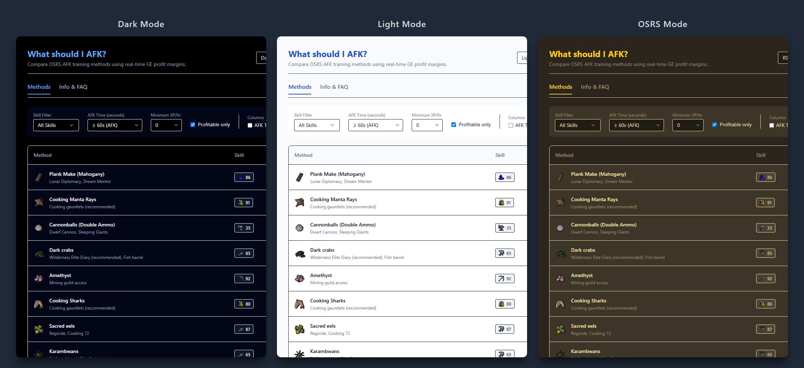

<p align="center">
  
</p>

# What should I afk? OSRS Reference Table

A web table for Old School RuneScape players that helps players to decide between  training methods based on AFK duration, XP rates and live Grand Exchange prices.

This is primarily a webpage (see [whatshouldiafk](https://whatshouldiafk.matthewd0yle.com/)), but it can also be installed on your machine as a standalone desktop application (not sure why you would want to, but I have).

The table displays information like:

- Uninterrupted AFK time intervals 
- Action intensity (interactions per hour)
- Live item prices (incorporating accurate profile/loss margins)
- GE buy limit sustainability for input materials
- Item price breakdowns
- Averages estimated from live drop table data

*Note: All AFK times, interactions per hour, and XP rates are referenced and verified against the official [OSRS Wiki](https://oldschool.runescape.wiki/) to ensure accurate estimations.*

---

**3 themes to choose from** 

<p align="center">
  
</p>

---

## Development

For adding new AFK methods or new features.

### Prerequisites

Before running or building this app, ensure you have the following installed:

- [Node.js](https://nodejs.org/) (v18+)
- [Rust](https://rustup.rs/) (v1.70+)

### Installation & Setup

1. **Clone or download** this repository.

2. **Install Node dependencies**:
   
   ```bash
   npm install
   ```

### Running in Development

To run the application in development mode (with hot module replacement):

```bash
npx tauri dev
```

*(This will launch the desktop application wrapper and start the Vite frontend server.)*

### Building for Production

To create a standalone, production-ready desktop installer:

```bash
npx tauri build
```

Once the build completes successfully, the resulting installers can be found in:

- **NSIS Installer (.exe):** `src-tauri/target/release/bundle/nsis/`
- **MSI Installer (.msi):** `src-tauri/target/release/bundle/msi/`

You can share these installers with others or install the application directly onto your machine.

### Customising Methods

The app uses a data-driven approach. You don't need to write any Rust or React code to add new methods.

Simply open `src/data/methods.json` and add a new JSON block following the existing structure. As long as you provide accurate `id` numbers for inputs and outputs (obtainable from the OSRS Wiki), the application will automatically pull their live prices and rank the method alongside the others upon reload.
